---
# Front matter
lang: ru-RU
title: "Отчет по лабораторной работе №1"
subtitle: "Установка и конфигурация операционной системы на виртуальную машину"
author: "Швец Сергей"
group: "НФИбд-03-18"
ID: "1032182976"

# Formatting
toc-title: "Содержание"
toc: true # Table of contents
toc_depth: 2
lof: true # List of figures
fontsize: 12pt
linestretch: 1.5
papersize: a4paper
documentclass: scrreprt
polyglossia-lang: russian
polyglossia-otherlangs: english
mainfont: PT Serif
romanfont: PT Serif
sansfont: PT Sans
monofont: PT Mono
mainfontoptions: Ligatures=TeX
romanfontoptions: Ligatures=TeX
sansfontoptions: Ligatures=TeX,Scale=MatchLowercase
monofontoptions: Scale=MatchLowercase
indent: true
pdf-engine: lualatex
header-includes:
  - \linepenalty=10 # the penalty added to the badness of each line within a paragraph (no associated penalty node) Increasing the value makes tex try to have fewer lines in the paragraph.
  - \interlinepenalty=0 # value of the penalty (node) added after each line of a paragraph.
  - \hyphenpenalty=50 # the penalty for line breaking at an automatically inserted hyphen
  - \exhyphenpenalty=50 # the penalty for line breaking at an explicit hyphen
  - \binoppenalty=700 # the penalty for breaking a line at a binary operator
  - \relpenalty=500 # the penalty for breaking a line at a relation
  - \clubpenalty=150 # extra penalty for breaking after first line of a paragraph
  - \widowpenalty=150 # extra penalty for breaking before last line of a paragraph
  - \displaywidowpenalty=50 # extra penalty for breaking before last line before a display math
  - \brokenpenalty=100 # extra penalty for page breaking after a hyphenated line
  - \predisplaypenalty=10000 # penalty for breaking before a display
  - \postdisplaypenalty=0 # penalty for breaking after a display
  - \floatingpenalty = 20000 # penalty for splitting an insertion (can only be split footnote in standard LaTeX)
  - \raggedbottom # or \flushbottom
  - \usepackage{float} # keep figures where there are in the text
  - \floatplacement{figure}{H} # keep figures where there are in the text
---

# Цель работы

Приобретение практических навыков установки операционной системы на виртуальную на виртуальную машину, настройки минимально необходимых для дальнейшей работы сервисов

# Последовательность выполнения работы

## Создём новую виртуальную машину
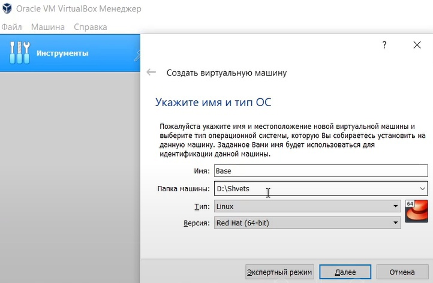{#fig:004 width=70% }

## Указываем объём оперативной памяти
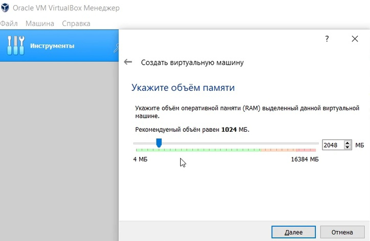{#fig:004 width=70% }

## Задаём тип жёсткого диска
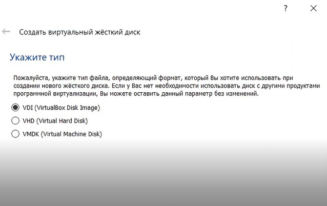{#fig:004 width=70% }

## Указываем имя и размер файла
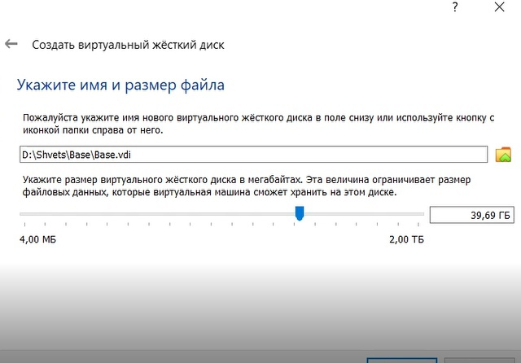{#fig:004 width=70% }

## Выбераем образ диска с дистрибутивом ОС
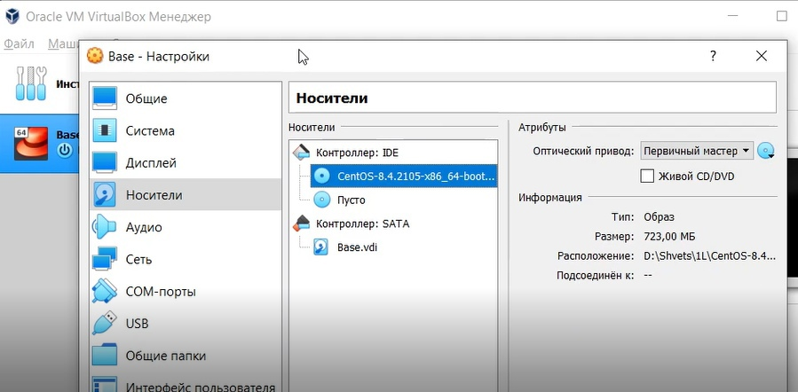{#fig:004 width=70% }

## Выберем язык
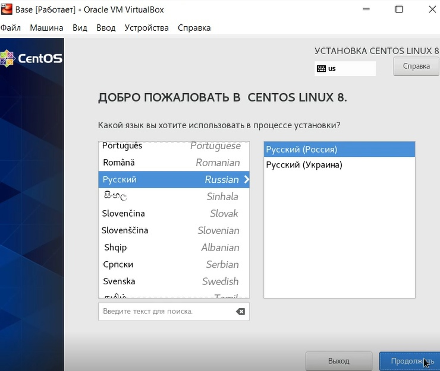{#fig:004 width=70% }

## Задаем имя узла
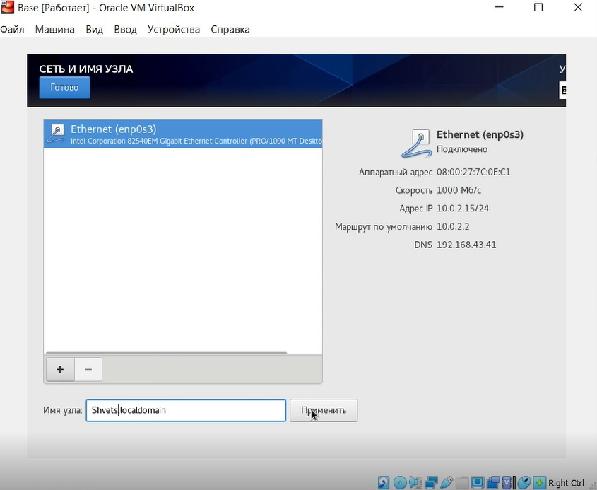{#fig:004 width=70% }

## Выберем базовое и дополнительное окружение
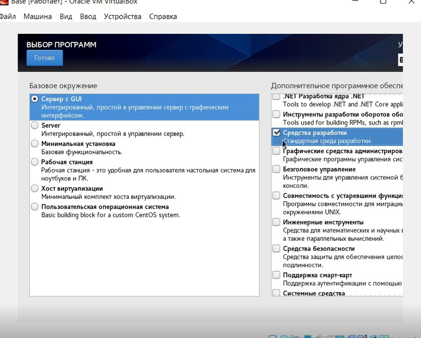{#fig:004 width=70% }

## Задаём пароль root
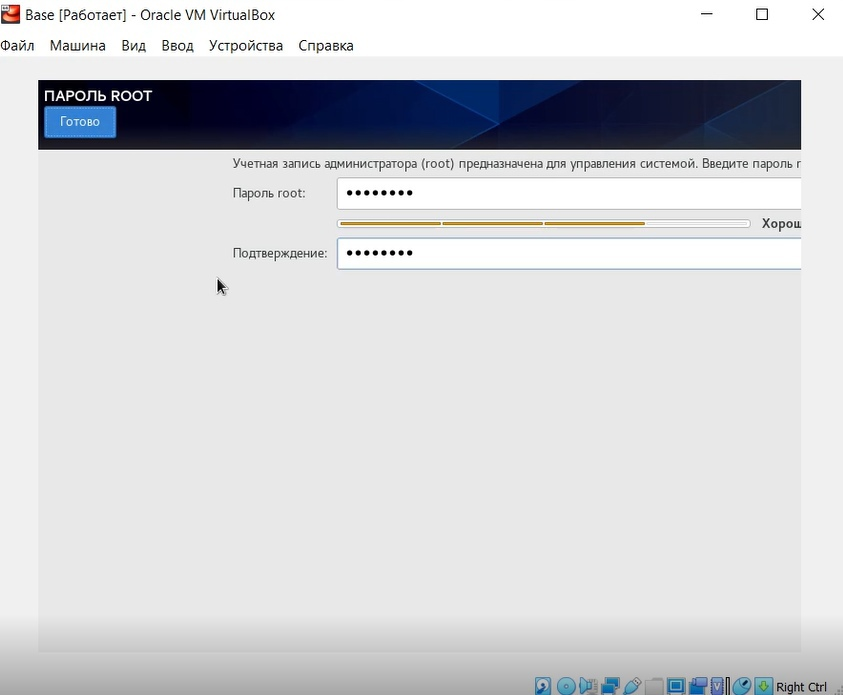{#fig:004 width=70% }

## Создём пользователя
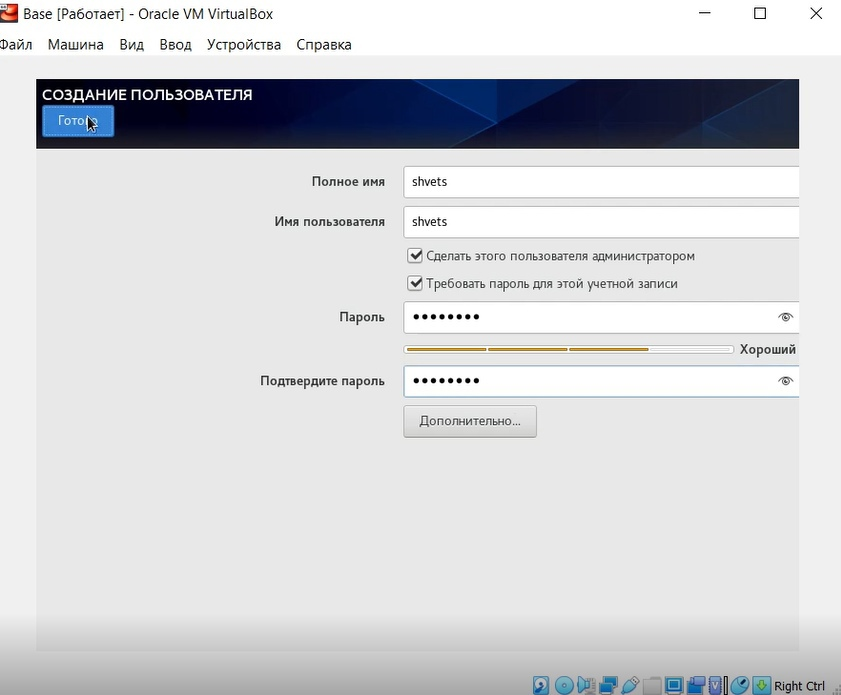{#fig:004 width=70% }

## Выбираем часовой пояс
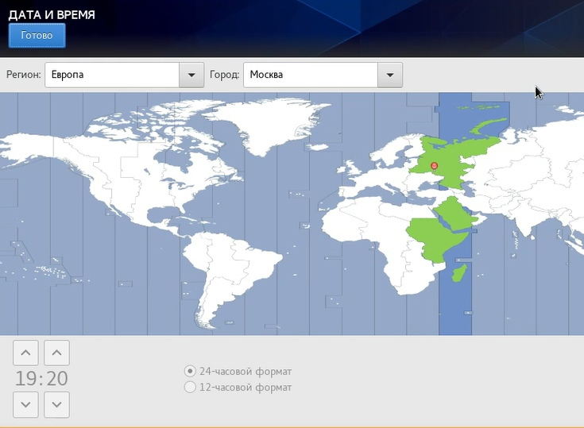{#fig:004 width=70% }

## Запскаем терминал, переходим под root и обновляем системные файлы
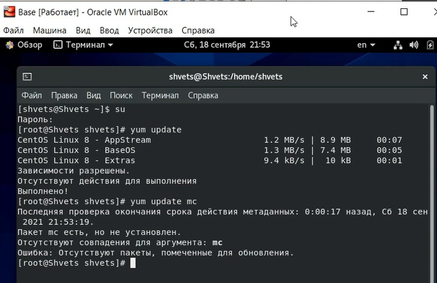{#fig:004 width=70% }

## Устанавливаем mc
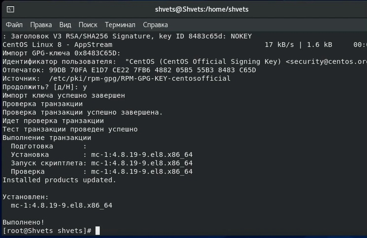{#fig:004 width=70% }

# Выводы
 Мы приобрели и закрепили практические навыки установки операционных систем на виртуальную машину, а также провели минимальную настройку.
