---
## Front matter
title: "Лабораторная работа №6: Мандатное
разграничение прав в Linux"
subtitle: "*дисциплина: Информационная безопасность*"
author: "Швец Сергей Сергеевич"
date: 2021, 27 november

## Formatting
mainfont: PT Serif
romanfont: PT Serif
sansfont: PT Sans
monofont: PT Mono
toc: false
slide_level: 2
theme: metropolis
header-includes:
 - \metroset{progressbar=frametitle,sectionpage=progressbar,numbering=fraction}
 - '\makeatletter'
 - '\beamer@ignorenonframefalse'
 - '\makeatother'
aspectratio: 43
section-titles: true

---

# Цель работы

Развить навыки администрирования ОС Linux. Получить первое практическое знакомство с технологией SELinux1
.
Проверить работу SELinx на практике совместно с веб-сервером
Apache.

# Выполнение работы

## Установка httpd

Установка httpd

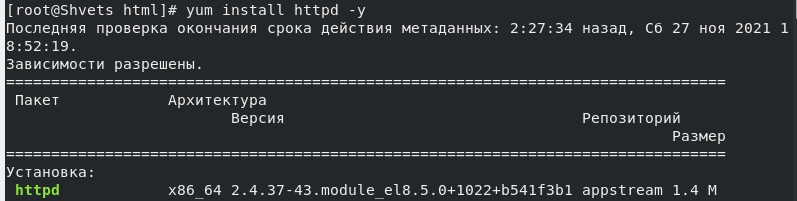{ #fig:001 width=70% }

## Вход в систему

Войдите в систему с полученными учётными данными и убедитесь, что
SELinux работает в режиме enforcing политики targeted с помощью команд getenforce и sestatus.

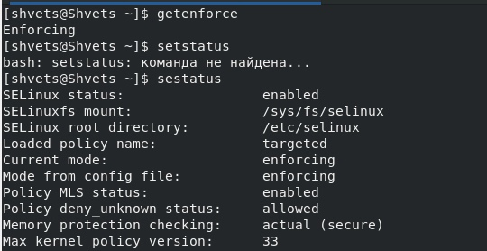{ #fig:002 width=70% }

## Обращение

Обращение с помощью браузера к веб-серверу, запущенному на
компьютере

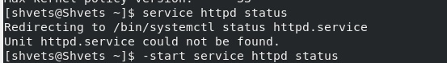{ #fig:003 width=70% }

## Контекст

Определение контекста безопасности .

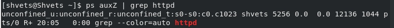{ #fig:005 width=70% }

## Состояние

Текущее состояние переключателей SELinux для Apache.

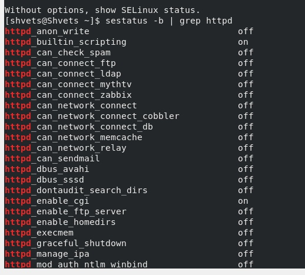{ #fig:006 width=70% }

## Файлы и поддиректории

Определение типа файлов и поддиректорий, находящихся в директории.

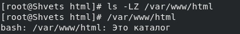{ #fig:008 width=70% }

## test.html

Создание файла test.html

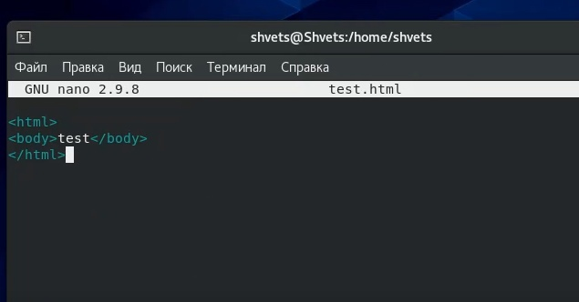{ #fig:007 width=70% }

## Учетная запись

Создание в домашней директории поддиректорию dir1 командой mkdir dir1. Определение командами ls -l и lsattr прав доступа и расширенных атрибутов.

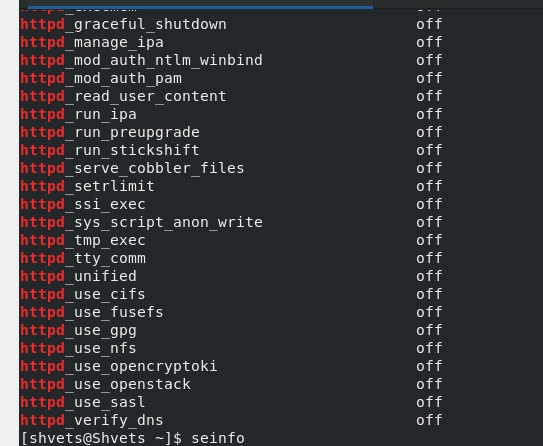{ #fig:009 width=70% }

## Учетная запись

Снятие с директории dir1 всех атрибутов командой chmod 000 dir1.

{ #fig:011 width=70% }

## log-файл

Просмотр системного log-файла.

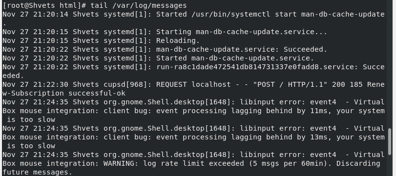{ #fig:012 width=70% }

## Попытка перезапуска

Попытка перезапуска сервера.

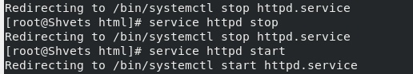{ #fig:013 width=70% }

## log-файлы

tail -nl /var/log/messages.

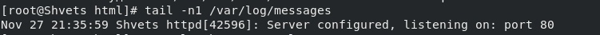{ #fig:013 width=70% }

## Список портов

semanage port -l | grep http_port_t.

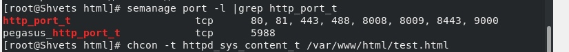{ #fig:013 width=70% }

# Выводы

Я ознакомился с базовыми с технологией SELinux. Развил навыки одминистратора и проверил работу SELinux на практике.
