---
## Front matter
title: "Лабораторная работа №2: Дискреционное разграничение прав в Linux. Основные атрибуты"
subtitle: "*дисциплина: Информационная безопасность*"
author: "Швец Сергей Сергеевич"
date: 2021, 02 October

## Formatting
mainfont: PT Serif
romanfont: PT Serif
sansfont: PT Sans
monofont: PT Mono
toc: false
slide_level: 2
theme: metropolis
header-includes:
 - \metroset{progressbar=frametitle,sectionpage=progressbar,numbering=fraction}
 - '\makeatletter'
 - '\beamer@ignorenonframefalse'
 - '\makeatother'
aspectratio: 43
section-titles: true

---

# Цель работы

Получение практических навыков работы в консоли с атрибутами файлов, закрепление теоретических основ дискреционного разграничения доступа в современных системах с открытым кодом на базе ОС Linux.

# Выполнение работы

## Создание учетной записи

В установленной при выполнении предыдущей лабораторной работы операционной системе создала учётную запись пользователя guest (используя учётную запись администратора): useradd guest. Задала пароль для пользователя guest (используя учётную запись администратора): passwd guest.

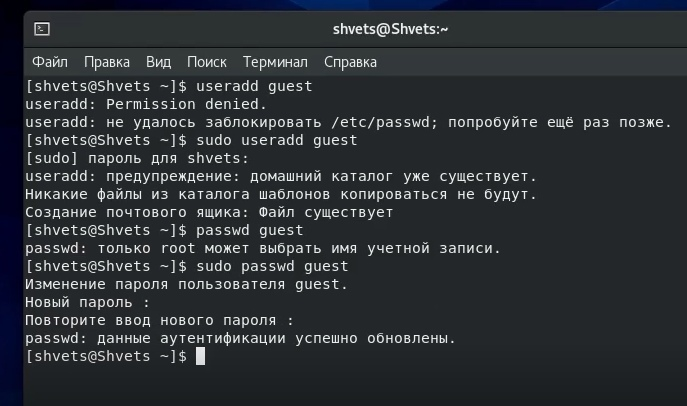{ #fig:001 width=70% }

## Учетная запись

Вход в систему через пользователя guest.

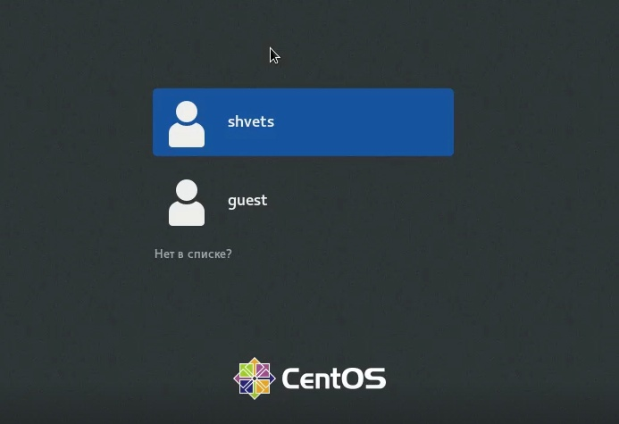{ #fig:002 width=70% }

## Учетная запись

Определение директории и уточнение имени пользователя

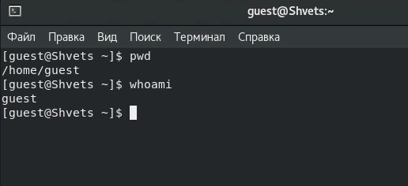{ #fig:003 width=70% }

## Учетная запись

Уточняем имя пользователя, группу, а также группы, куда входит пользователь, посредством команды id.

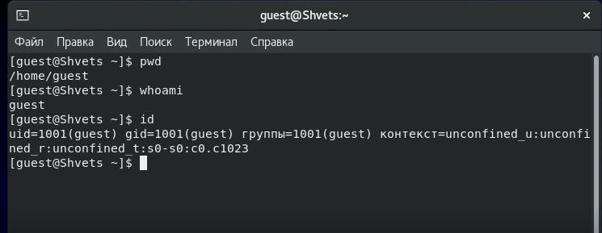{ #fig:005 width=70% }

## Учетная запись

Просмотр файла командой cat /etc/passwd, поиск учетной записи, определение uid, gid пользователя.

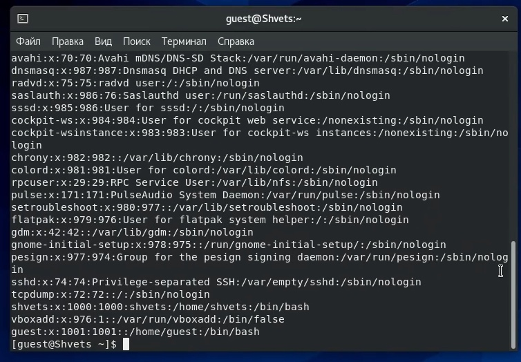{ #fig:006 width=70% }

## Учетная запись
Определение существующих в системе директорий командой ls -l /home/.

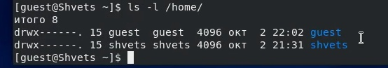{ #fig:007 width=70% }

## Учетная запись

Проверка расширенных атрибутов поддиректорий, находящихся в /home расширенные атрибуты установлены на поддиректориях, находящихся в директории /home.

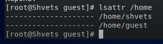{ #fig:008 width=70% }

## Учетная запись

Создание в домашней директории поддиректорию dir1 командой mkdir dir1. Определение командами ls -l и lsattr прав доступа и расширенных атрибутов.

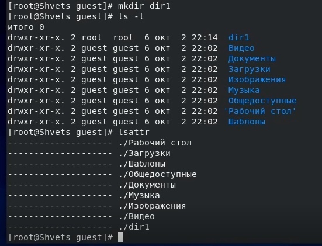{ #fig:009 width=70% }

## Учетная запись

Снятие с директории dir1 всех атрибутов командой chmod 000 dir1.

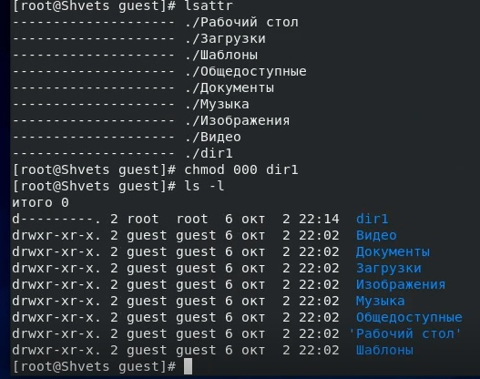{ #fig:011 width=70% }

## Учетная запись

Попытка создания в директории dir1 файла file1 командой echo "test" > /home/guest/dir1/file1.

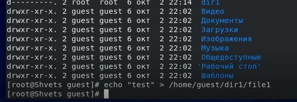{ #fig:012 width=70% }

## Таблица

Таблица с установленными правами и разрешенными действиями.

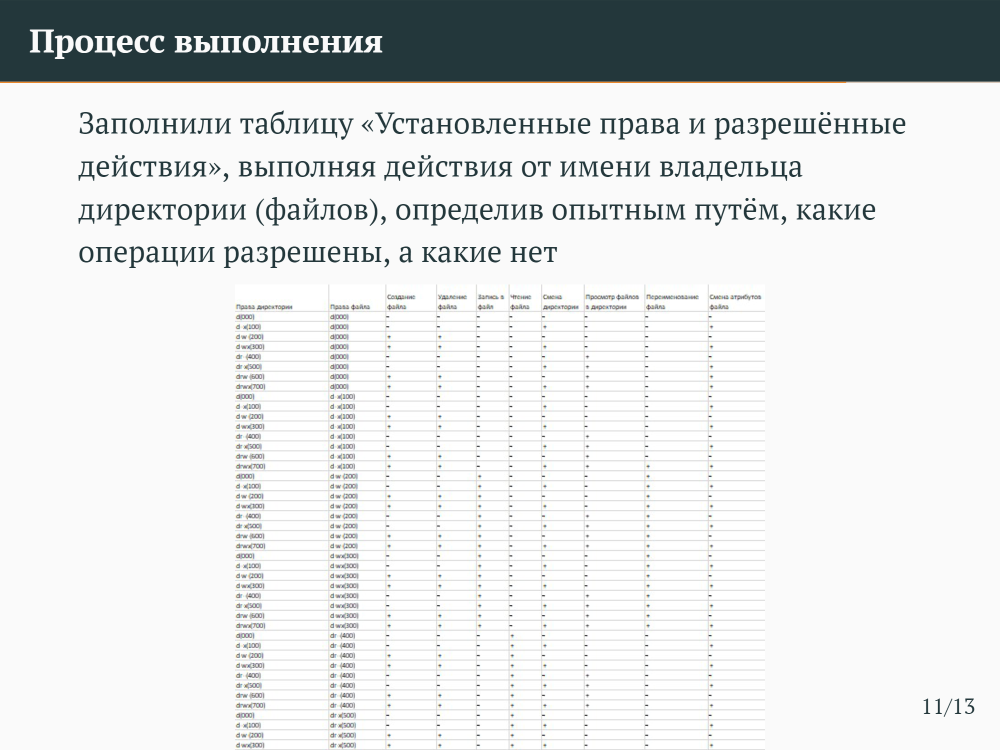{ #fig:013 width=70% }

# Выводы

Мной были получены практические навыки работы в консоли с атрибутами файлов, закреплены теоретические основы дискреционного разграничения доступа в современных системах с открытым кодом на базе ОС Linux.
