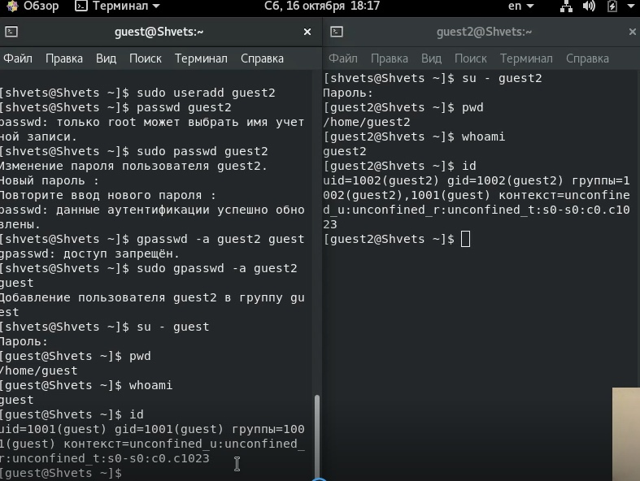

---
## Front matter
title: "Лабораторная работа №3: Дискреционное разграничение прав в Linux. Два пользователя"
subtitle: "*дисциплина: Информационная безопасность*"
author: "Швец Сергей Сергеевич"
date: 2021, 16 October

## Formatting
mainfont: PT Serif
romanfont: PT Serif
sansfont: PT Sans
monofont: PT Mono
toc: false
slide_level: 2
theme: metropolis
header-includes:
 - \metroset{progressbar=frametitle,sectionpage=progressbar,numbering=fraction}
 - '\makeatletter'
 - '\beamer@ignorenonframefalse'
 - '\makeatother'
aspectratio: 43
section-titles: true

---

# Цель работы

Получение практических навыков работы в консоли с атрибутами файлов для групп пользователей.

# Выполнение работы

## Создание учетной записи

{ #fig:001 width=70% }

## Учетная запись

Определение директории и уточнение имени пользователя

{ #fig:003 width=70% }

## Учетная запись

Определяем директорий, в которых они находятся .

{ #fig:005 width=70% }

## Учетная запись

Определение имен пользователей, их групп и принадлежностей.

{ #fig:006 width=70% }

## Учетная запись

Определение групп /etc/group

{ #fig:007 width=70% }

## Учетная запись

Просмотр содержимого файла /etc/group

{ #fig:008 width=70% }

## Учетная запись

Регистрация guest2 в группе guest.

{ #fig:009 width=70% }

## Таблица

Таблица с установленными правами и разрешенными действиями.

{ #fig:009 width=70% }

Таблица с установленными правами и разрешенными действиями.

{ #fig:009 width=70% }

Таблица с установленными правами и разрешенными действиями.

{ #fig:009 width=70% }

Минимально необходимые права для совершения операций от имени пользователей входящих в группу

{ #fig:009 width=70% }

# Выводы

Мной были получены практические навыки работы в консоли с атрибутами файлов для групп пользователей в современных системах с открытым кодом на базе ОС Linux.
