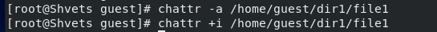

---
## Front matter
title: "Лабораторная работа №4: Дискреционное разграничение прав в Linux. Расширенные атрибуты"
subtitle: "*дисциплина: Информационная безопасность*"
author: "Швец Сергей Сергеевич"
date: 2021, 30 October

## Formatting
mainfont: PT Serif
romanfont: PT Serif
sansfont: PT Sans
monofont: PT Mono
toc: false
slide_level: 2
theme: metropolis
header-includes:
 - \metroset{progressbar=frametitle,sectionpage=progressbar,numbering=fraction}
 - '\makeatletter'
 - '\beamer@ignorenonframefalse'
 - '\makeatother'
aspectratio: 43
section-titles: true

---

# Цель работы

Получение практических навыков работы в консоли с расширенными атрибутами файлов.

# Выполнение работы

## Установка прав

{ #fig:001 width=70% }

## Расширение атрибутов

Установка расширенных атрибутов a на файл
/home/guest/dir1/file1 от имени суперпользователя.

{ #fig:003 width=70% }

## Проверка атрибутов

Проверка правильность установки атрибутов.

{ #fig:005 width=70% }

## Заполнение и чтение файла

Выполнение дозаписи в файл file1 слова «test». Далее
чтение файла file1.

{ #fig:006 width=70% }

## Расширенные атрибуты

Снятие расширенного атрибута а и смена его на i.

{ #fig:007 width=70% }

## file2

Создание файла file2 и запись в него слова test.

{ #fig:008 width=70% }

## Изменение содержимого

Изменение содержимого файла file2.

{ #fig:009 width=70% }

## Права доступа

Попытка изменить права доступа.

{ #fig:009 width=70% }

## Наблюдение

При установке атрибута a файл может
быть открыт для записи только в режиме добавления текста.
Атрибут i не позволяет модифицировать файл, и может быть снят только суперпользователем.

# Выводы

Мной были получены практические навыки работы в консоли с расширенными атрибутами файлов для групп пользователей в современных системах с открытым кодом на базе ОС Linux.
